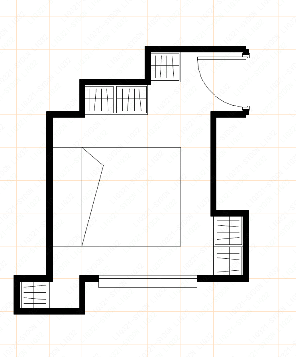
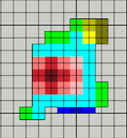
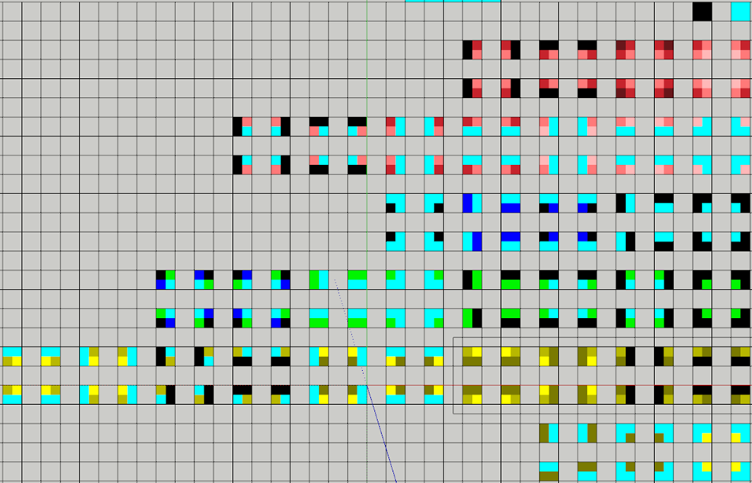
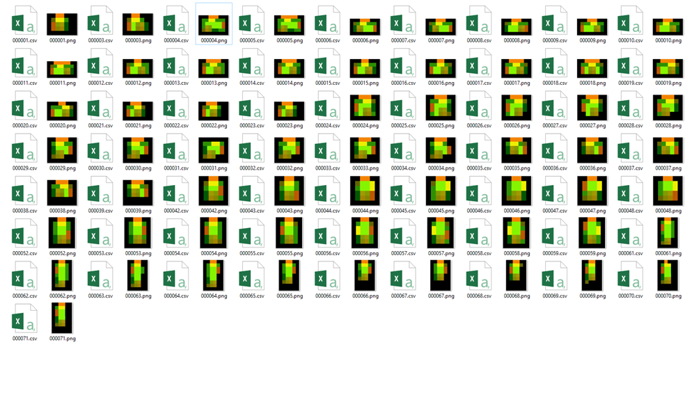
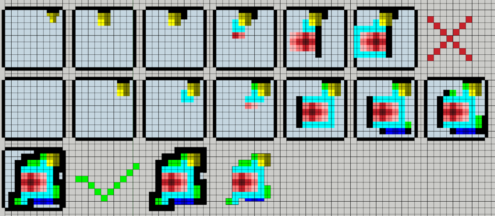
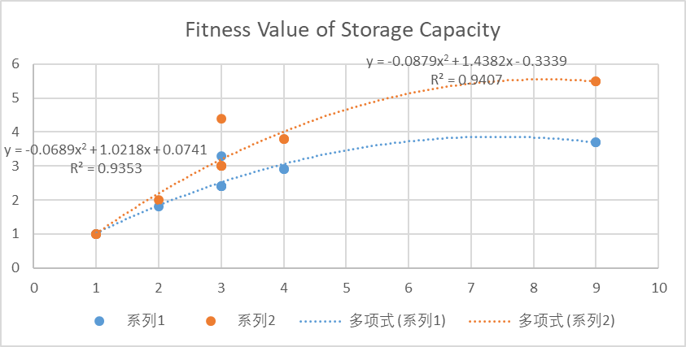
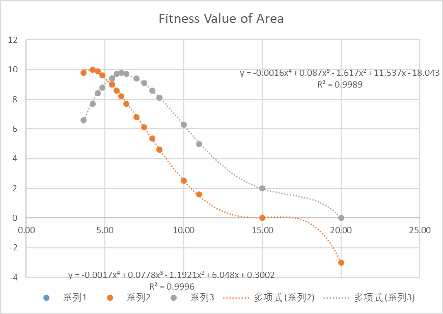
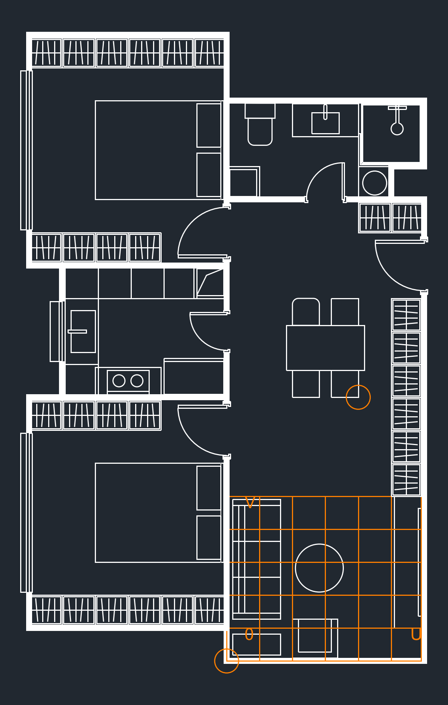
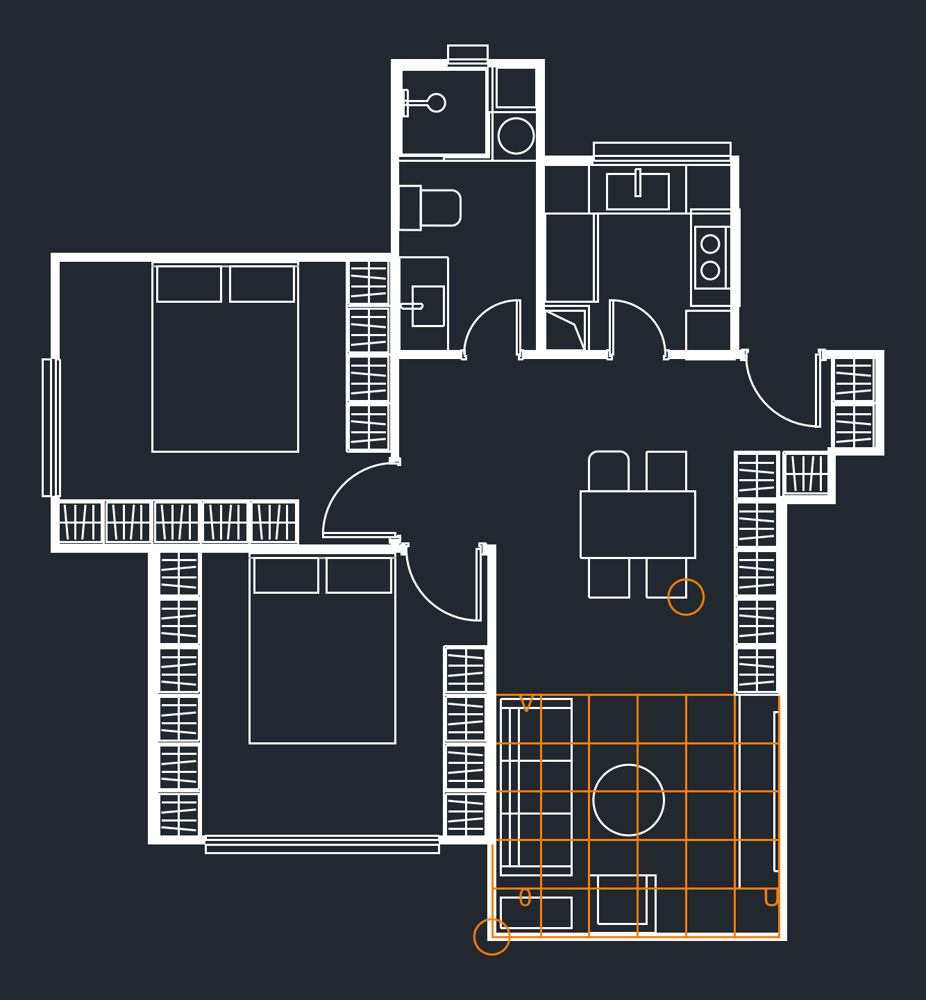
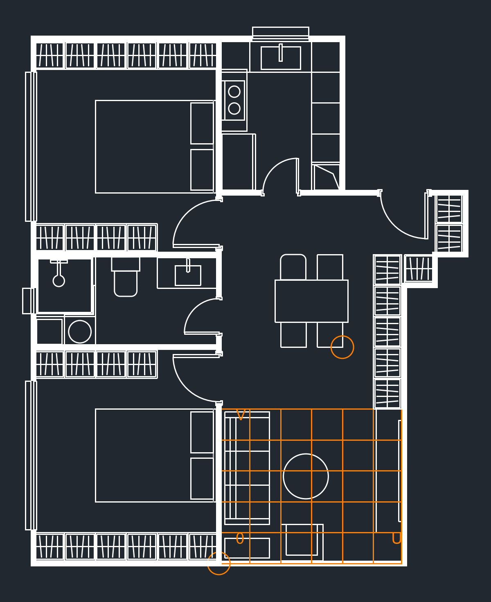

## Floor Plan Generator Using Wave Function Collapse Algorithm
### Independent Study, 2022, (python)
[github repository](https://github.com/ludwigpeking/WFC_floorPlan_Generation.git)

A. The algorithm: WFC algorithm (originated by Maxim Gumin) is based on randomness and locally bounded spatial interconnection; therefore it is not experience dependent and has full openness to innovative designs; It is a bottom-up approach, which is rooted from the fundamental elements and tectonic logics.

B. The library of valid connections: the possibility of interconnection is vast and easily buggy. Some techniques are applied to streamline the making of the library:
   1. The technique of pixelating the interconnections: (images below: a random floor plan of a bedroom and its pixelation). Therefore, a case of interconnection is abstracted as a quadrant with a color value at each corner.

    
     
   2. Library automatically generated from samples. It can be considered as a machine learning process. There is the risk of not being able to exhaust all possibilities. But it avoids mistakes by manual operation.

*Valid connections in a bedroom, manually defined.*

*Samples of a kitchen, from which a library of valid connections and their frequency in kitchens is extracted.*

C. A selection of size of grid: the size of the grid greatly affects the expensiveness of the generation. Efficiency and details are not to be achieved at the same time. Instead of using a conventional grid of 20cm or 30cm, I use a grid of 55cm. Despite being quick, the dimension of 55cm is the width between two arms of a person that has to do with the depth of wardrobe, the narrow passage in the room, and the depth of counters.

D. ‘Collapse’: in each step, the entropies of all cells are calculated, and the one with the lowest entropy collapses to a valid connected tile.

   

E. Fitness Calculation: there should be different evaluations for different purposes. But in general, there are three values taken into consideration:
   1. Perimeter to area ratio, a decreasing function;
   2. Area is an increasing function below a certain value, but becomes a decreasing function after a suitable area; In luxury housing, the marginal declination of fitness value on area is smaller than that in compact housing.
   3. Storage capacity is an increasing function with declining margin.

      
      
      *Fitness curves on area and storage capacity, compact and luxury types requiring different parameters in fitness functions*

F. From parts to the whole: Each room (bedroom, bathroom, kitchen, living room) has its own fitness value. Those generated with higher value are kept as components for the generation of the whole apartment floor plan.

   
   
   
   *Generation results with high fitness values.*

G. The living rooms have more intricate silhouettes. They are generated as the connecting parts for the other rooms. And the whole apartment has its overall fitness value.

## Usage

Although this project does not contain a large amount of complicated code, it has not yet solved the problem of being user-friendly and is still under development. This note is intended to help readers understand the project's procedure.

### Steps

#### 1. Provide Cases
This step is crucial for the algorithm to understand the valid interrelationships of the building blocks and their frequency. Different rooms' cases were created manually and separately using a small tool created by the script in `design.py`. In the repository, the cases I have created are already in the folders.

#### Tile Size
The standard tile size is 55cm, which corresponds to the width between the two arms of a person. This measurement is relevant for the depth of a wardrobe, the narrow passage in a room, and is also close to the depth of counters, the sizes of fridges, and washing machines. All items are rounded to 55cm. For example, wall thickness, whether 7cm or 20cm, is rounded to 0. The widths of doors, whether 90cm or 100cm, are all rounded to a module with 2 tile width - 110cm.

#### 2. Make Rooms
`jigsaw.py` in each folder is the main script for generating the rooms. It retains the schemes with the highest scores.

#### 3. Make the Combined Floor Plan
Then, in the 'combine' folder, the script can access all the room schemes and create combined floor plans for a complete unit.

#### 4. Fitness Function
The fitness function (or the evaluation) is included in the main script as polynomial equations. Currently, you have to find it in the script and manually change the coefficients.
