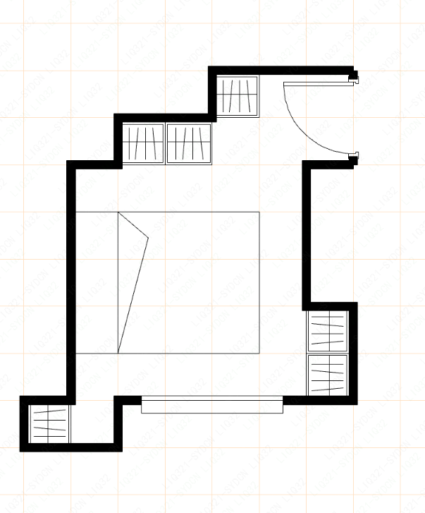
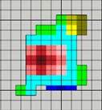
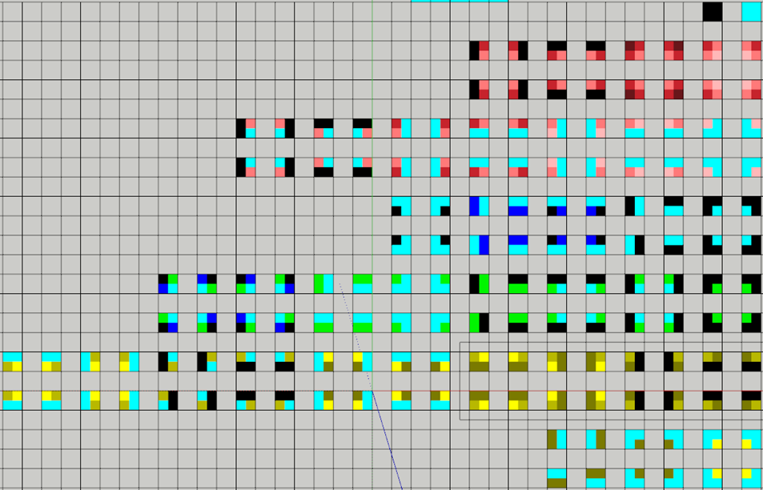
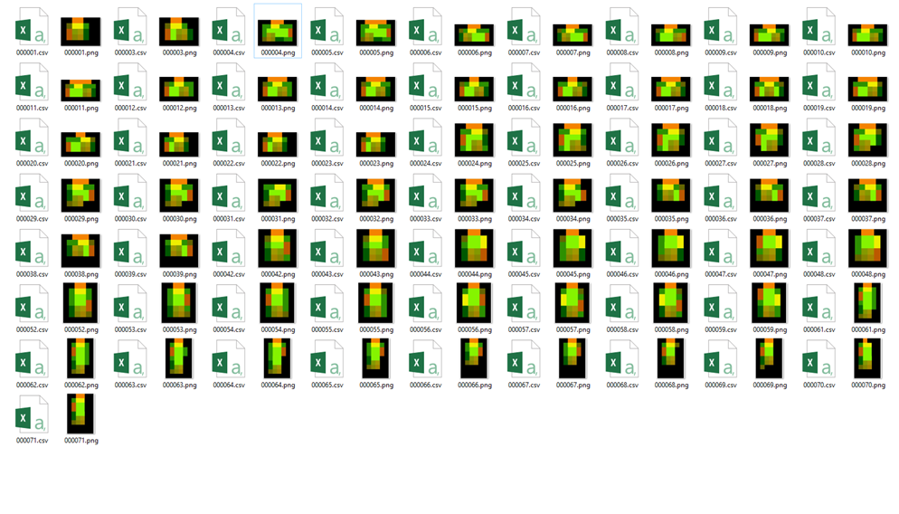
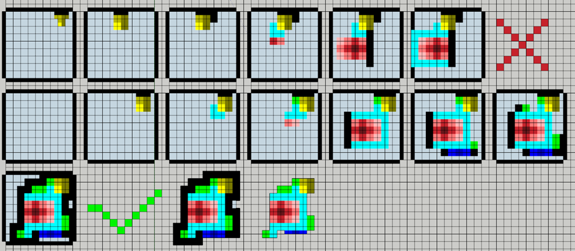
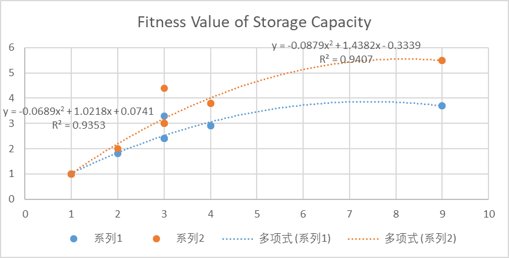
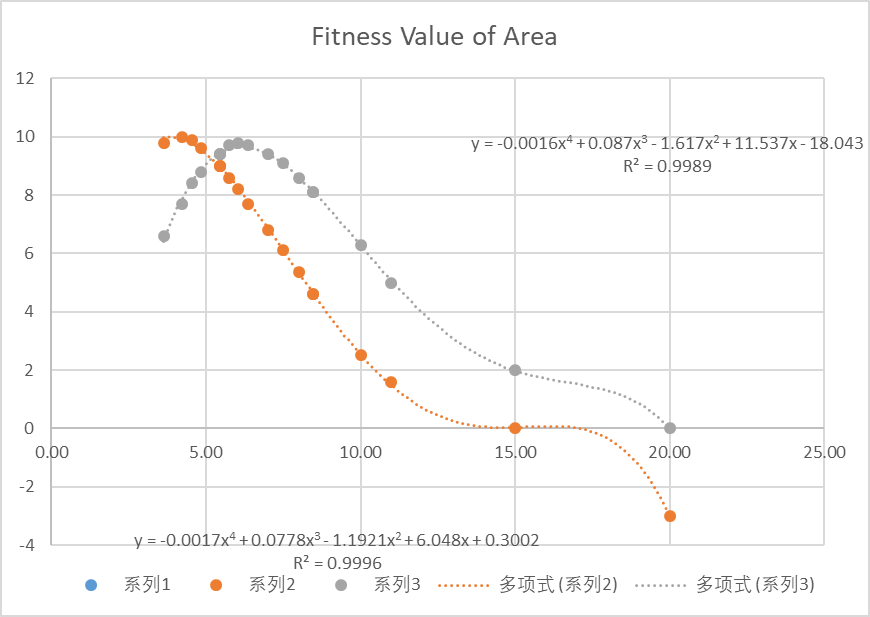
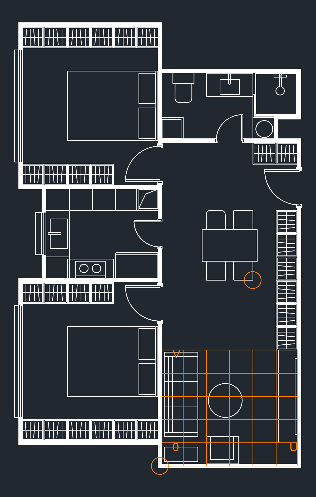
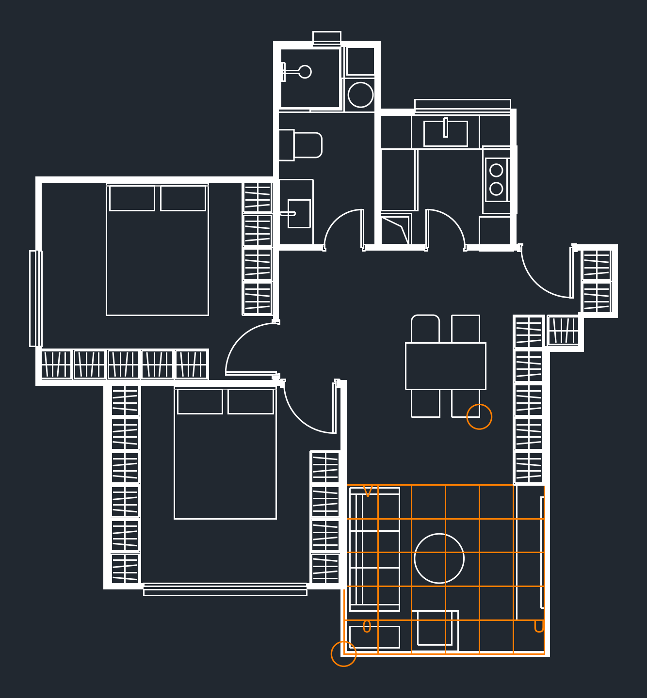
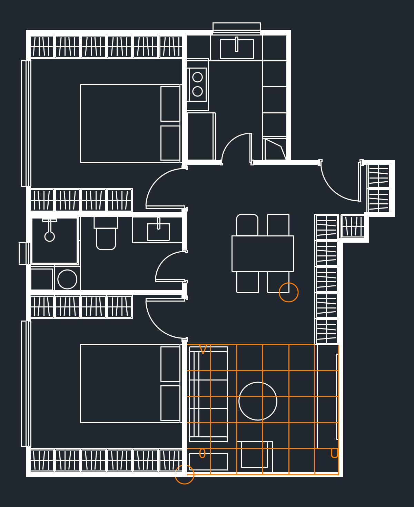

## Floor Plan Generator Using Wave Function Collapse Algorithm

### Independent Study, 2022, (python)

## Table of Contents
1. [Floor Plan Generator Using Wave Function Collapse Algorithm](#floor-plan-generator-using-wave-function-collapse-algorithm)
    - [Independent Study, 2022, (python)](#independent-study-2022-python)
2. [Algorithm Overview](#algorithm-overview)
    - [The Algorithm](#a-the-algorithm)
    - [The Library of Valid Connections](#b-the-library-of-valid-connections)
    - [Selection of Grid Size](#c-a-selection-of-size-of-grid)
    - [Collapse Process](#d-collapse)
    - [Fitness Calculation](#e-fitness-calculation)
    - [From Parts to the Whole](#f-from-parts-to-the-whole)
3. [Usage](#usage)
    - [Steps](#steps)
        - [Provide Cases](#1-provide-cases)
        - [Tile Size](#tile-size)
        - [Make Rooms](#2-make-rooms)
        - [Make the Combined Floor Plan](#3-make-the-combined-floor-plan)
        - [Fitness Function](#4-fitness-function)

[github repository](https://github.com/ludwigpeking/WFC_floorPlan_Generation.git)

## A. The algorithm: 
WFC algorithm (originated by Maxim Gumin) is based on randomness and locally bounded spatial interconnection; therefore it is not experience dependent and has full openness to innovative designs; It is a bottom-up approach, which is rooted from the fundamental elements and tectonic logics.

## B. The library of valid connections: 
the possibility of interconnection is vast and easily buggy. Some techniques are applied to streamline the making of the library:

### 1.  The technique of pixelating the interconnections: 
(images below: a random floor plan of a bedroom and its pixelation). Therefore, a case of interconnection is abstracted as a quadrant with a color value at each corner.

 
  2. Library automatically generated from samples. It can be considered as a machine learning process. There is the risk of not being able to exhaust all possibilities. But it avoids mistakes by manual operation.

_Valid connections in a bedroom, manually defined._

_Samples of a kitchen, from which a library of valid connections and their frequency in kitchens is extracted._

### C. A selection of size of grid: 
the size of the grid greatly affects the expensiveness of the generation. Efficiency and details are not to be achieved at the same time. Instead of using a conventional grid of 20cm or 30cm, I use a grid of 55cm. Despite being quick, the dimension of 55cm is the width between two arms of a person that has to do with the depth of wardrobe, the narrow passage in the room, and the depth of counters.

### D. ‘Collapse’: 
in each step, the entropies of all cells are calculated, and the one with the lowest entropy collapses to a valid connected tile.

### E. Fitness Calculation: 
there should be different evaluations for different purposes. But in general, there are three values taken into consideration:

1.  Perimeter to area ratio, a decreasing function;
2.  Area is an increasing function below a certain value, but becomes a decreasing function after a suitable area; In luxury housing, the marginal declination of fitness value on area is smaller than that in compact housing.
3.  Storage capacity is an increasing function with declining margin.

    
    
    _Fitness curves on area and storage capacity, compact and luxury types requiring different parameters in fitness functions_

### F. From parts to the whole: 
Each room (bedroom, bathroom, kitchen, living room) has its own fitness value. Those generated with higher value are kept as components for the generation of the whole apartment floor plan.
  
 
 

_Generation results with high fitness values._

## Usage

### The single-page studio (2026)

Open `index.html` in a browser. Nothing to install: the samples, the generator and the drawing code are all inside that one file. The four tabs follow the procedure described below.

1. **Samples** – draw or edit the cases the generator learns from (the old `design.py`). Pick an element, rotate it with `R`, flip it with `F`, click to stamp. Samples can be imported and exported as CSV in the original format.
2. **Tile library** – every 2 × 2 window of every sample, with its frequency (the old `blocks.py`).
3. **Generate rooms** – the collapse itself (the old `jigsaw.py` scripts). Grid size, count rules, score threshold and every coefficient of the fitness curves are inputs on the page. "Watch the collapse" replays attempts step by step; "Refine" regrows half of each good scheme.
4. **Combine apartment** – attaches two bedrooms, a bathroom and a kitchen to the access openings of each living room (the old `05 - combine`). Only apartments above the score threshold are kept (12 by default), every window must have a clear view, no gap may be enclosed between rooms, and one apartment is kept per living room so the list stays varied.
5. **3D collection** – the kept apartments and rooms as abstract models: walls cut low, furniture and fixtures reduced to simple blocks. The same 3D view is available in every gallery and in the detail view, where the model can be dragged round.

Schemes whose drawings are the same (window positions aside) are kept only once. Any scheme can be exported as PNG, DXF or CSV, and the whole session can be saved to and loaded from one JSON file. "Generate all four room types now" on the Combine tab runs the complete pipeline.

Drawings use the furniture, fixture and door blocks of the 2022 `blocks.dxf` files (flattened and stored inside the page), placed by the same rules as the original `dxf_blocks.py` scripts: bedrooms and the entrance get the wide door, bathroom and kitchen the narrow one, and a door's two-cell opening includes its wall stubs and frame.

The page is a re-implementation in JavaScript, not a wrapper around the Python scripts. It keeps their method – door first, lowest entropy next, frequency-weighted choice, the same fitness formulas and default coefficients – but replaces the per-room special cases with one generator driven by count rules, so its results are not identical to the 2022 output.

### The introduction film

`film/WFC_Floor_Plan_Introduction.mp4` is a short narrated introduction (Chinese narration, Chinese and English subtitles). The narration text is in `film/narration.json` (`text` is spoken, `zh`/`en` are the subtitles, `parts` splits a long line into several subtitles), the voice clips in `film/voice/` (synthesized at speech rate 25, i.e. 1.25×), and the notebook and whiteboard photos in `img/photos/`.

To rebuild it, in `film/`:

1. `npm install`
2. `node capture_screens.js` – screenshots of the page (needs Chrome)
3. `node make_film.js --refresh --preview 1` – generates the rooms and apartments once and caches them
4. `node export_models.js`, then `blender -b -P render_models.py -- hero` and `blender -b -P render_models.py -- grid` – the 3D chapter, rendered with Blender Cycles
5. `node make_film.js` – draws every frame and encodes the film (needs ffmpeg)

`node make_film.js --language en` makes the English version, `film/WFC_Floor_Plan_Introduction_EN.mp4`: English narration from `film/voice-en/` (the `text_en` field of `narration.json`, synthesized at speech rate 15), with English-only captions and subtitles.

`node make_cover.js` draws the covers in `film/cover/`, landscape and portrait, in Chinese and in English (`cover_en_*`). It needs the two stills from `blender -b -P render_models.py -- cover`, and sets the title in the font file found in `film/fonts/`.

### The original Python scripts (2022)

Although this project does not contain a large amount of complicated code, it has not yet solved the problem of being user-friendly and is still under development. This note is intended to help readers understand the project's procedure.

### Steps

#### 1. Provide Cases

This step is crucial for the algorithm to understand the valid interrelationships of the building blocks and their frequency. Different rooms' cases were created manually and separately using a small tool created by the script in `design.py`. In the repository, the cases I have created are already in the folders.

#### Tile Size

The standard tile size is 55cm, which corresponds to the width between the two arms of a person. This measurement is relevant for the depth of a wardrobe, the narrow passage in a room, and is also close to the depth of counters, the sizes of fridges, and washing machines. All items are rounded to 55cm. For example, wall thickness, whether 7cm or 20cm, is rounded to 0. The widths of doors, whether 90cm or 100cm, are all rounded to a module with 2 tile width - 110cm.

#### 2. Make Rooms

`jigsaw.py` in each folder is the main script for generating the rooms. It retains the schemes with the highest scores.

#### 3. Make the Combined Floor Plan

Then, in the 'combine' folder, the script can access all the room schemes and create combined floor plans for a complete unit.

#### 4. Fitness Function

The fitness function (or the evaluation) is included in the main script as polynomial equations. Currently, you have to find it in the script and manually change the coefficients.
